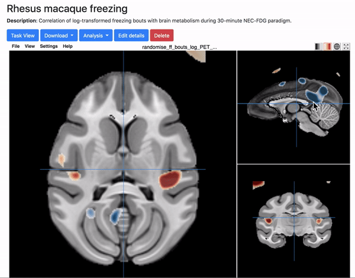

# Getting Started with NeuroVault
**by Dan Holley, UC Davis Fox Lab for Translational Affective Neuroscience**

NeuroVault is a public tool for sharing, searching, and downloading unthresholded statistical maps, parcellations, and atlases from both human and nonhuman-animal studies.
  
This blog entry covers:
1. Getting started and uploading your first image;
2. Interacting with and sharing your image; and
3. Searching NeuroVault

## Part 1: Getting Started and Uploading Your First Image

Upon navigating to www.neurovault.org, users can login to access an existing account, or follow the login process to create an account:

Once you’ve logged in, navigate back to the NeuroVault landing page, and click “Get started and upload an image!”:

You’ll arrive at a page entitled “My collections.” To upload an image, first create a collection. This is the place to detail important aspects of your subjects, design, acquisition, registration, etc. Although the only required field is the name of your collection, found under the ‘Essentials’ tab, we encourage users to peruse the tabs and be as descriptive as possible in the interest of preventing unintentional misuse of datasets.

Once you are satisfied with the details provided in the ‘Add new collection’ tabs, scroll to the bottom of the page and click ‘Save’ to advance to a page that supports individual image uploading:

Note the option to toggle between public and private. Private images are shareable (i.e., accessible to anyone with the link), but not searchable. Public images are both shareable and searchable.

Now that you’ve arrived at the page that supports individual image uploads, you’ll be required to fill out several fields annotating your file, such as your filename, map type (e.g., zmap, tmap, etc.), and acquisition modality (e.g., PET FDG, fMRI, etc.). Several file types (e.g., .img, .nii, .nii.gz, etc.) are supported, and are listed in the form.

These options pertain to the image you’d like to upload. Clicking ‘Submit’ uploads the image to NeuroVault. <b>Importantly, this is also the step that requires you to specify the “target template image” by selecting from human, rhesus, and mouse templates.</b>NeuroVault is currently configured for neuroimaging data aligned to human, rhesus, and mouse templates.
  

## Part 2: Interacting with and Sharing Your Image
Once you click ‘Submit,’ your image will upload to the archive, and you’ll be able to view and interact with it immediately:

Above, we see unthresholded PET FDG data aligned to the Rhesus Macaque Template.
  
To adjust the threshold, use the ‘color gradient’-type icon in the top right of the viewer:

Click/drag any of the three viewing panes to move through the data, and use the spacebar to switch between horizontal, coronal, and sagittal axes:

To share your image, simply grab its URL and send it to your collaborators.

## Part 3: How to Search NeuroVault

NeuroVault provides easy search functionality. Try typing a few keywords in the search bar at the top right of the screen, and pressing enter to generate results. Here are some results for the search term anxiety:

In summary, NeuroVault is a helpful tool for researchers who would like to share, search for, and combine neuroimaging datasets from both human and nonhuman species. Here, we discussed how to get started with NeuroVault, with a focus on uploading your first image. Thank you for taking the time to read this tutorial, and please let me know if you have any questions.

